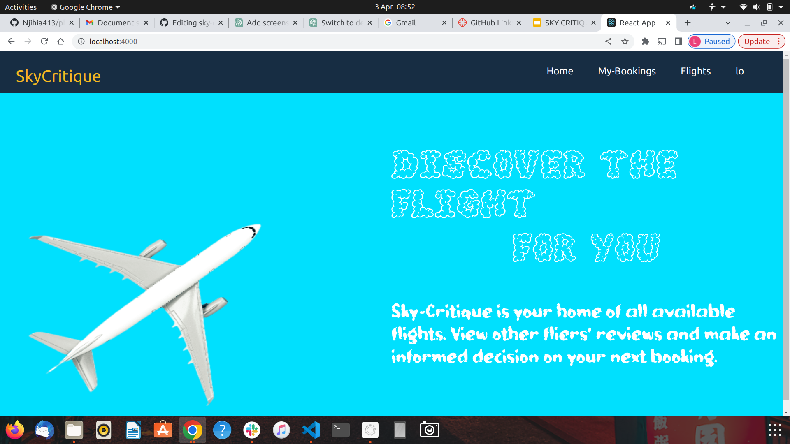
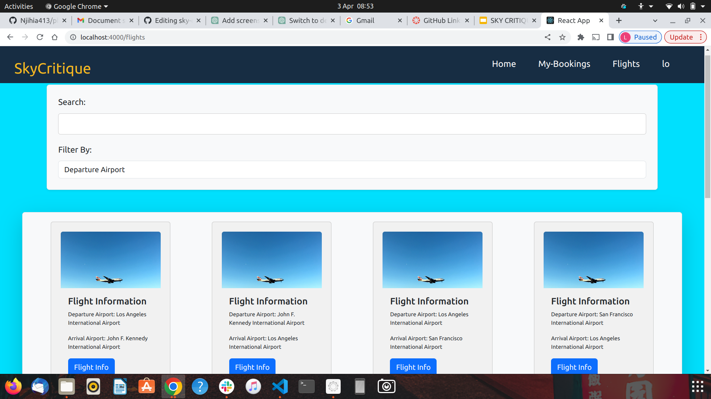
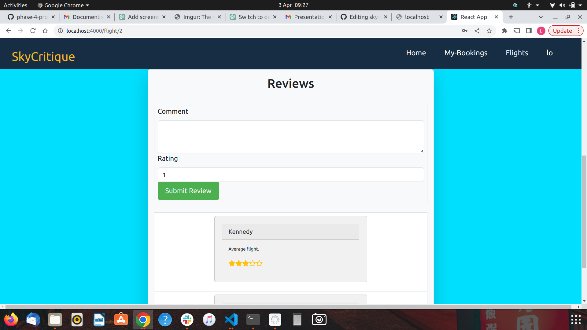
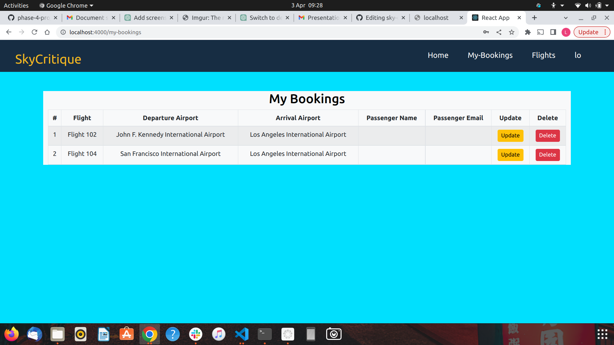
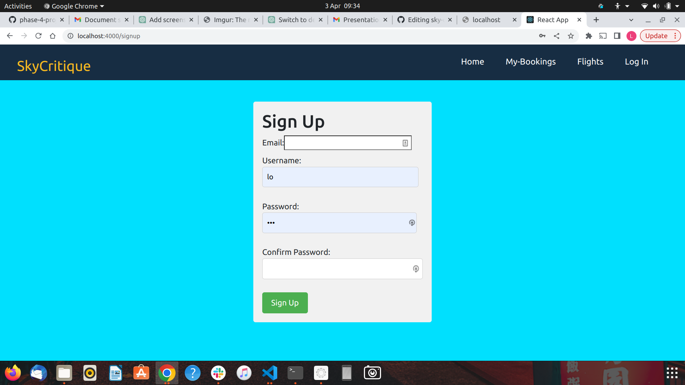
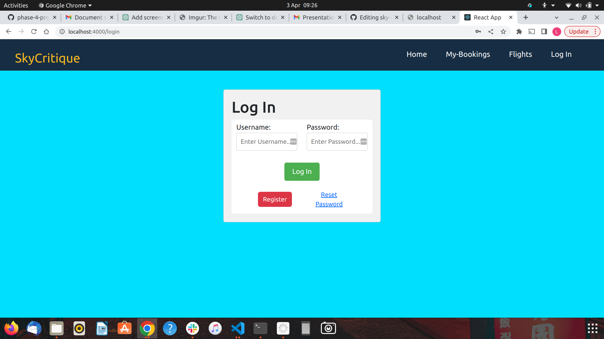

[](https://github.com/Malcolm-G/sky-critique/graphs/commit-activity)
[](https://github.com/Malcolm-G/sky-critique/network)
[](https://github.com/Malcolm-G/sky-critique/blob/main/Licence)
[](http://makeapullrequest.com)
[](https://svgshare.com/i/Zhy.svg)
[](https://github.com/ellerbrock/open-source-badges/)

# Sky-Critique
Sky-Critique is a web application built with React as the frontend and Ruby on Rails as the backend API. The application uses SQLite as its database. The app allows users to view flights from different airports, make a booking for a flight, and leave a review about a flight.

## Built With
This application has been built with the following tools:


- **React `18.2.+`**
- **Ruby `v2.7.+`**
- **SQlite3 `v1.6`**
- **ActiveRecord `v7.0.4`**
- **Rake `v13.0.6`**
- **Puma `v6.1`**
- **Rails `v7.0.4`**
- **active_model_serializers `v0.10.13`**
- **faker `v3.1.1`**

## Features
- User authentication: Users can sign up and log in to the application using their email and password.
- View Flights: Users can view flights from different airports.
- Booking: Users can make a booking for a flight.
- Review: Users can leave a review about a flight.
<!-- Admin panel: Admins can manage users, flights, and reviews. -->

## Installation
To run Sky-Critique locally, you must have the following installed:

- **Ruby version 2.7.0 or later**
- **Rails version 6.0.3.4 or later**
- **Node.js version 12.0.0 or later**
- **SQLite version 3.24.0 or later**

1. Clone the repository:
   
        git clone https://github.com/your-username/sky-critique.git

2. Install the dependencies for the API:

        cd sky-critique/api
        bundle install
        rails db:create
        rails db:migrate
        rails db:seed

3. Start the Rails server:

        rails server

4. Open a new terminal and navigate to the client directory:

        cd ../client

5. Install the dependencies for the React client:

        npm install

6. Start the React client:

        npm start

7. Open your browser and go to http://localhost:3000.

## Using the Application

1. Sign up or log in to the application.
2. Browse flights by selecting an airport.
3. Click on a flight to view more details.
4. To book a flight, select the number of seats and click the "Book" button.
5. To leave a review, click on the "Leave a Review" button and fill out the form.

# Some Screenshots
* Homepage


<br />

* Flights


<br />

* Flight Reviews


<br />

* Booking


<br />

* Signup Page


<br/>

* Login Page


<br/>

## Contributing
This project was contributed to by:

- [Malcolm Githuka](https://github.com/Malcolm-G)
- [Kennedy Icika](https://github.com/Icika-max)
- [Louis Okwaro](https://github.com/LouisOkwaro)
- [Mark Njogu](https://github.com/treva556)

Contributions to Sky-Critique are welcome! If you find a bug or have an idea for a new feature, please create an issue or submit a pull request.

## License
Sky-Critique is released under the GNU GENERAL PUBLIC LICENSE v3.

```markdown
Copyright 2023

Permission is hereby granted, free of charge, to any person obtaining a copy of this software and associated documentation files (the “Software”), 
to deal in the Software without restriction, including without limitation the rights to use, copy, modify, merge, publish, distribute, sublicense, and/or sell copies of the Software, 
and to permit persons to whom the Software is furnished to do so, subject to the following conditions:

The above copyright notice and this permission notice shall be included in all copies or substantial portions of the Software.

THE SOFTWARE IS PROVIDED “AS IS”, WITHOUT WARRANTY OF ANY KIND, EXPRESS OR IMPLIED, INCLUDING BUT NOT LIMITED TO THE WARRANTIES OF MERCHANTABILITY, FITNESS FOR A PARTICULAR PURPOSE AND NONINFRINGEMENT. 
IN NO EVENT SHALL THE AUTHORS OR COPYRIGHT HOLDERS BE LIABLE FOR ANY CLAIM, DAMAGES OR OTHER LIABILITY, WHETHER IN AN ACTION OF CONTRACT, TORT OR OTHERWISE, ARISING FROM, OUT OF OR IN CONNECTION WITH THE SOFTWARE OR THE USE OR OTHER DEALINGS IN THE SOFTWARE.
```
